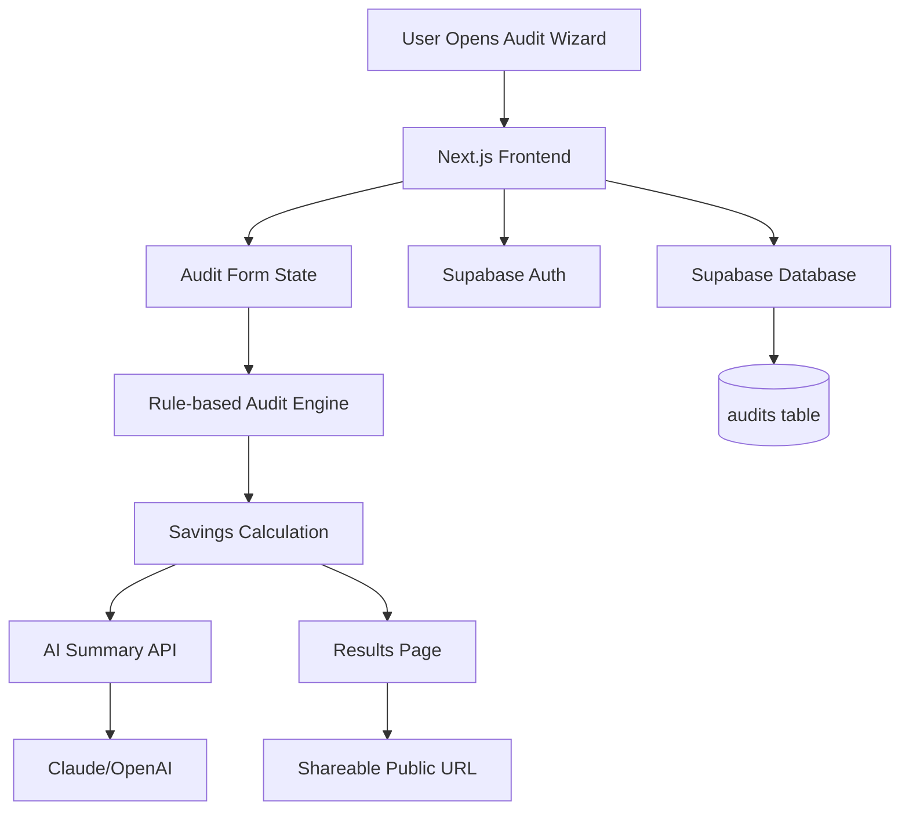

# ARCHITECTURE.md — StackSpend AI

## Overview

StackSpend AI is a SaaS spend audit platform built with Next.js, Supabase, and a planned AI recommendation layer. Users complete a guided audit wizard, and the platform surfaces optimization insights, waste scores, and estimated savings.

---
## System Architecture Diagram



## Tech Stack

| Layer | Technology | Purpose |
|---|---|---|
| Frontend | Next.js 14 (App Router) | UI, routing, SSR/RSC |
| Styling | Tailwind CSS + tailwind-merge + clsx | Utility-first styling |
| Animations | Framer Motion | Wizard transitions, UI polish |
| Icons | Lucide React | Consistent icon system |
| Auth | Supabase Auth | Email/password signup & login |
| Database | Supabase (PostgreSQL) | Audit submissions, user data |
| Hosting | Vercel (planned) | Deployment & edge functions |
| AI Layer | TBD (Claude API / OpenAI) | Optimization recommendations |

---

## Folder Structure

```
stackspend-ai/
├── app/
│   ├── (auth)/
│   │   ├── login/page.tsx
│   │   
│   ├── dashboard/
│   │   └── page.tsx            # Main dashboard (protected)
│   ├── audit/
│   │   └── page.tsx            # Multi-step audit wizard
│   ├── results/
│   │   └── page.tsx            # Audit results & insights
│   └── layout.tsx
├── components/
│   ├── ui/                     # Reusable UI primitives
│   ├── audit/                  # Wizard step components
│   └── dashboard/              # Metrics cards, history table
├── lib/
│   ├── supabase/
│   │   ├── client.ts           # Browser Supabase client
│   │   └── server.ts           # Server Supabase client
│   └── utils.ts
├── components.json             # shadcn/ui config
└── next.config.ts
```

---

## Data Flow

```
User fills Audit Wizard
        ↓
React state manages multi-step form
        ↓
On submit → Supabase INSERT (audits table)
        ↓
Dashboard fetches audit history → Supabase SELECT
        ↓
Results page renders insights (static logic today, AI-driven tomorrow)
```

---

## Supabase Schema

### `audits` table

| Column | Type | Notes |
|---|---|---|
| id | uuid | Primary key |
| user_id | uuid | FK → auth.users |
| created_at | timestamptz | Auto |
| company_name | text | From wizard step 1 |
| tool_count | int | Number of SaaS tools |
| monthly_spend | numeric | Self-reported spend |
| tools_list | jsonb | Array of tool objects |
| waste_score | int | Computed 0–100 |
| estimated_savings | numeric | Computed value |
| recommendations | jsonb | AI-generated or rule-based |

---

## Auth Architecture

- Supabase Auth with email/password
- Session managed via Supabase SSR helpers
- Server components read session via `createServerClient`
- Client components use `createBrowserClient`
- Protected routes check session; redirect to `/login` if missing
- Post-login redirect → `/dashboard`

---

## Key Architectural Decisions

**App Router over Pages Router** — Chosen for better server component support and future-proofing. Caused early friction with React Router imports (resolved by removing react-router-dom entirely).

**Supabase over custom backend** — Fastest path to working auth + DB without managing infrastructure. Trade-off: less control over query optimization.

**Rule-based recommendations (MVP)** — AI-generated insights deferred to Day 3. Current logic uses spend thresholds and tool count heuristics to generate recommendations.

**Client vs Server component split** — Auth state and interactive UI live in client components. Data fetching for dashboard history uses server components with Supabase server client.

---

## Environment Variables

```env
NEXT_PUBLIC_SUPABASE_URL=
NEXT_PUBLIC_SUPABASE_ANON_KEY=
```

---

## Planned Additions

- [ ] Vercel deployment with environment variable config
- [ ] Row Level Security (RLS) policies on `audits` table
- [ ] AI recommendation endpoint (Claude API or OpenAI)
- [ ] Protected route middleware (`middleware.ts`)
- [ ] Audit versioning (allow re-audits over time)

---

## Audit Engine Architecture

The core recommendation system uses deterministic business rules instead of fully AI-generated pricing decisions. This approach was chosen to ensure predictable, explainable, and financially consistent optimization outputs.

The audit engine evaluates:
- Selected AI tool
- Current subscription plan
- Team size
- Monthly spend
- Primary workflow/use case

Based on these inputs, the engine:
1. Compares pricing tiers
2. Evaluates plan suitability
3. Detects overspending scenarios
4. Calculates optimized spend
5. Estimates monthly & annual savings
6. Generates waste scores and recommendations

### Example Rule

```ts
if (tool === "chatgpt" && seats <= 2 && plan === "team") {
  recommend("plus")
}


## Testing Strategy

The platform includes automated unit tests focused on the audit recommendation engine. Jest and TypeScript are used to validate pricing optimization logic, recommendation generation, savings calculations, and edge-case scenarios.

Current test coverage includes:
- Plan downgrade recommendations
- Cross-tool optimization suggestions
- Annual savings calculations
- Waste score validation
- Organization-wide spend aggregation

The testing layer helps ensure deterministic and financially believable audit outputs as recommendation logic expands.

---

## Dynamic Results Routing

Audit reports use dynamic App Router segments:

```txt
/results/[id]


## Security Considerations

Several security practices were considered during architecture planning:

- Supabase authentication for secure session handling
- Planned Row Level Security (RLS) policies
- Protected dashboard routes
- Environment variable isolation
- Separation of client/server Supabase instances
- Input validation across audit forms
- Future rate-limiting for AI endpoints

Sensitive API keys are excluded from the repository using environment variables and `.gitignore`.

## Scaling to 10k Audits/Day

If StackSpend AI needed to support 10k+ audits/day, I would introduce:

- Queue-based audit processing using background jobs
- Redis caching for repeated pricing lookups
- Database indexing for audit retrieval
- Rate limiting on AI summary endpoints
- CDN caching for public audit pages
- Edge deployment for lower latency
- Batched analytics processing
- Separate worker services for AI summary generation

The current MVP architecture prioritizes speed of iteration and product validation over infrastructure complexity.