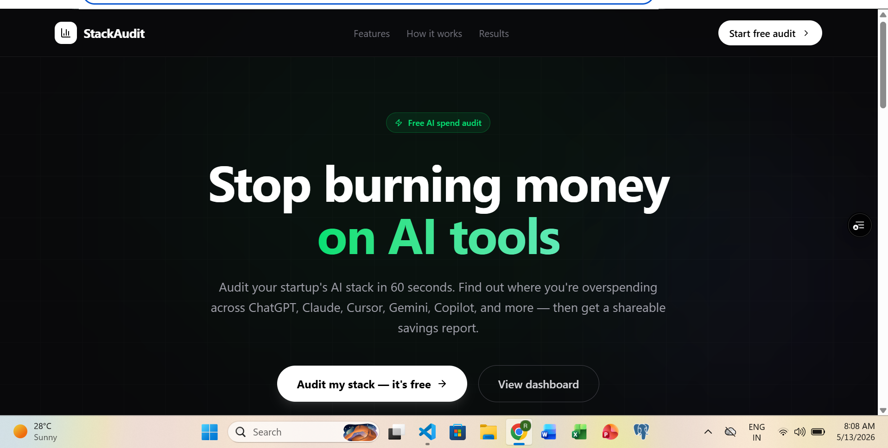
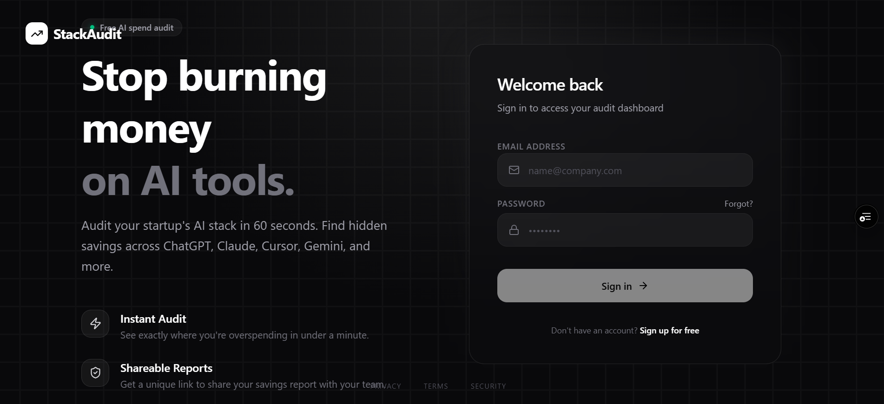
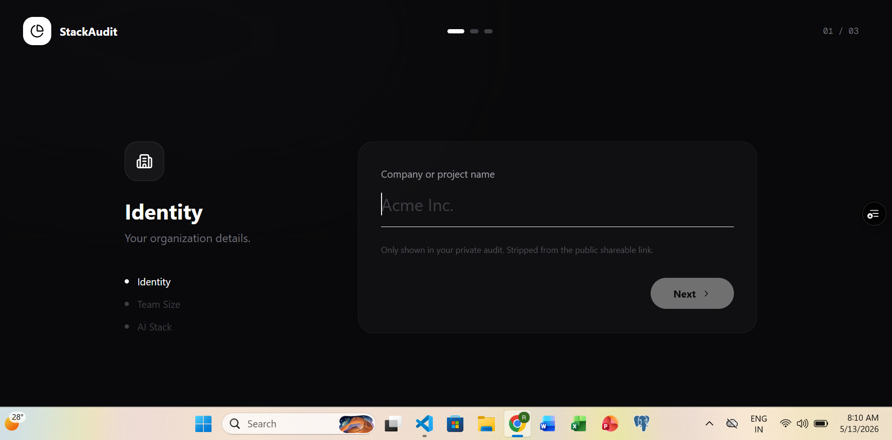
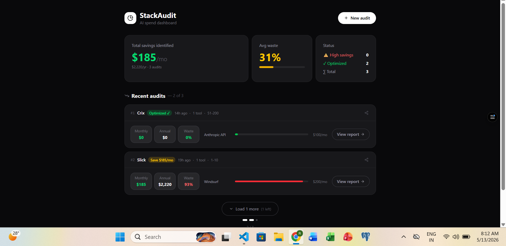
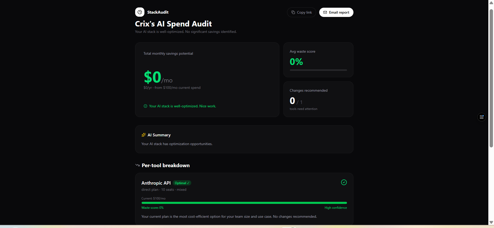
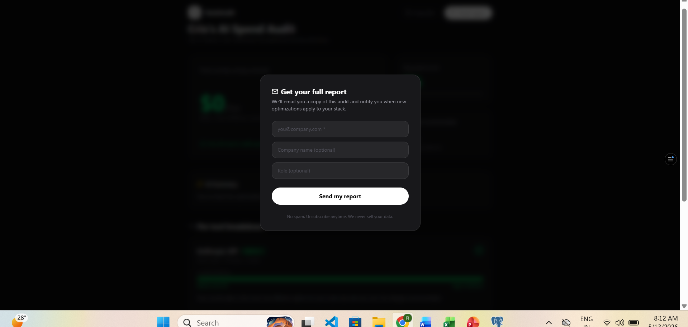
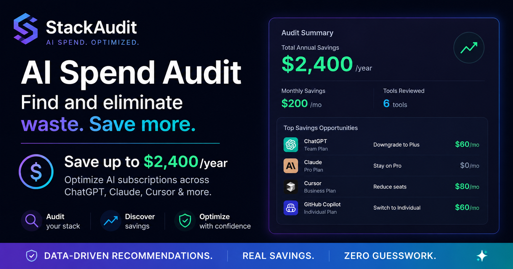

# StackSpend AI

StackSpend AI is an AI spend audit platform that helps startups analyze and optimize their AI tool subscriptions. The platform identifies overspending across tools like ChatGPT, Claude, Cursor, Copilot, Gemini, and more by recommending better plans, alternative tools, and potential savings opportunities.

The goal of the project is to provide startups and engineering teams with an instant AI cost optimization report while helping them understand how to reduce unnecessary spending.

---


Instant AI subscription cost optimization for startups and engineering teams.

# Features

- AI tool spend audit
- Personalized savings recommendations
- Monthly and annual savings calculations
- AI-generated audit summaries
- Shareable audit reports
- Lead capture and email reports
- Public audit URLs with Open Graph previews

---

# Tech Stack

## Frontend
- Next.js 15
- TypeScript
- Tailwind CSS
- shadcn/ui

## Backend
- Next.js API Routes

## Database
- Supabase

## Additional Services
- Resend (emails)
- OpenAI / Anthropic API
- Vercel Deployment

---

# Project Structure

```txt
src/
 ├── app/
 ├── components/
 ├── data/
 ├── lib/
 ├── services/
 ├── tests/
 ├── types/
 └── utils/
```

---

# Getting Started

## Clone the Repository

```bash
git clone https://github.com/Takshsri/Stackspend-ai
```

## Install Dependencies

```bash
npm install
```

## Run Development Server

```bash
npm run dev
```

Open:

```txt
http://localhost:3000
```

---
# Environment Variables

Create a `.env.local` file:

```env
NEXT_PUBLIC_SUPABASE_URL=
NEXT_PUBLIC_SUPABASE_ANON_KEY=
SUPABASE_SERVICE_ROLE_KEY=
NEXT_PUBLIC_SITE_URL=
```


# Current Progress

- Landing page completed
- AI spend audit flow implemented
- Savings recommendation logic added
- Shareable audit reports implemented
- Public audit URLs with Open Graph support
- Email report flow integrated
- Responsive UI completed
- Deployed on Vercel

# Planned Features

- Team-based spend analytics
- PDF export for audit reports
- Advanced AI pricing comparison engine
- Multi-workspace support
- Subscription renewal reminders
- Historical spending trends

# Decisions

1. Chose Next.js App Router for scalability and modern React patterns.
2. Used TypeScript for better maintainability and type safety.
3. Selected shadcn/ui for reusable and accessible UI components.
4. Keeping the audit engine rule-based instead of AI-generated for financial consistency.
5. Using Supabase to simplify backend storage and deployment.

# Deployment

The project is deployed on Vercel for fast global delivery and seamless CI/CD integration.

# Links

- Live App: https://stackspend-ai.vercel.app
- GitHub Repo: https://github.com/Takshsri/Stackspend-ai


# Screenshots

| Landing Page | Login Page |
|---|---|
|  |  |

| Audit Page | Dashboard |
|---|---|
|  |  |

| Audit Report | Shared Report |
|---|---|
|  |  |


